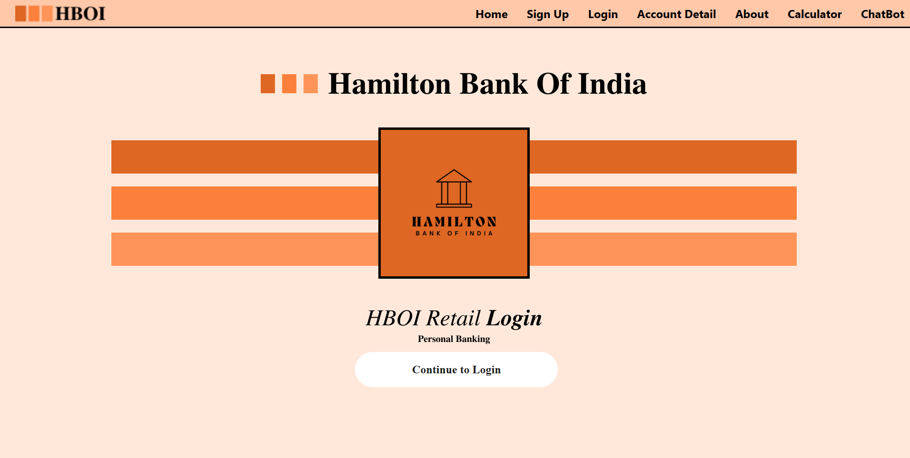
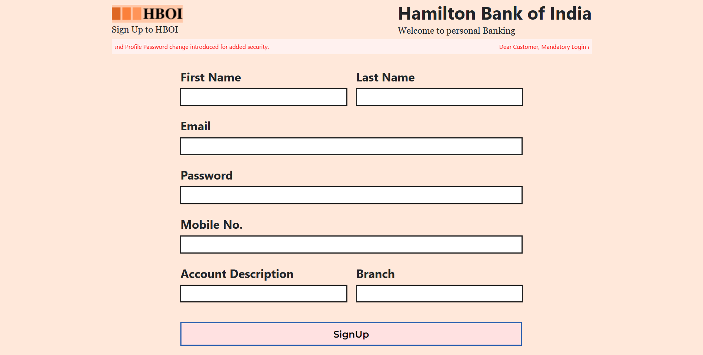
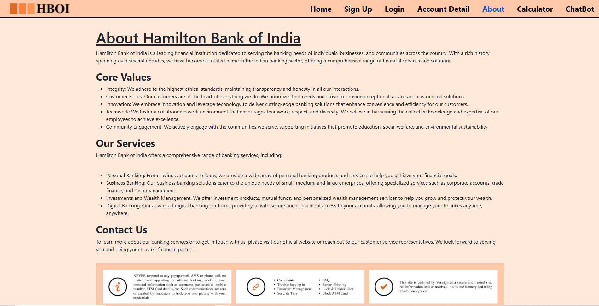

# HBOI - Hamilton Bank of India

HBOI is a digital banking application developed by the Hamilton Bank of India. The application provides users with convenient access to banking services through a secure online platform. The primary features of the application include login/signup functionality, a chatbot, and a premium calculator.

## Website Link

https://hboi.netlify.app/

## API Documentation

https://documenter.getpostman.com/view/27643465/2s93m7V1Zq

## Features 

- ***Chatbot:*** The website includes a chatbot feature that allows users to interact with an automated system to get information, assistance, or support related to banking services. The chatbot can provide responses to common queries and help guide users through various processes.

- ***Premium Calculator:*** The website includes a premium calculator feature, which allows users to calculate insurance premiums or other financial calculations based on specific parameters. This feature helps users estimate costs or potential returns on their investments or insurance policies.

- ***User-Friendly Interface:*** The website is designed with a user-friendly interface, making it easy for visitors to navigate and find the information or services they need. The interface may feature intuitive menus, clear labels, and organized content to enhance the user experience.

- ***Login/Signup Facility:*** The website provides a login/signup facility that allows users to create accounts or access their existing accounts. Through this feature, users can securely access personalized banking services, view account information, make transactions, and perform other account-related activities.

## Screenshots

Home Page

Login Page

SignUp Page

Premium Calculator 

HBOI - ChatBot 

About Us

## Future Scope

- ***Enhanced Personalization:*** The website can further evolve by incorporating advanced personalization techniques. By leveraging user data and preferences, the website can offer personalized recommendations for financial products, customized interfaces, and tailored content based on individual user profiles.

- ***Expanded Services:*** The website can expand its range of services to offer a more comprehensive banking experience. This may include features such as online account opening, loan applications, investment management tools, financial planning calculators, bill payment options, and more. Providing a broader range of services can attract and retain more customers.

- ***Mobile App Development:*** As mobile usage continues to rise, developing a mobile application alongside the website can enhance accessibility and convenience for users. The app can offer similar features to the website, allowing customers to access their accounts, perform transactions, interact with the chatbot, and utilize the premium calculator on their smartphones or tablets.

- ***Integration of AI and Machine Learning:*** The website can leverage advancements in AI and machine learning to enhance the chatbot's capabilities. By continuously learning from user interactions, the chatbot can become smarter, better at understanding user intent, and provide more accurate responses. This can result in improved customer service and a more seamless user experience.

- ***Security and Fraud Prevention:*** Given the increasing concerns related to cybersecurity and online fraud, the website can focus on strengthening security measures. Implementing advanced authentication methods, encryption protocols, and monitoring systems can help safeguard user data and prevent unauthorized access or fraudulent activities.
